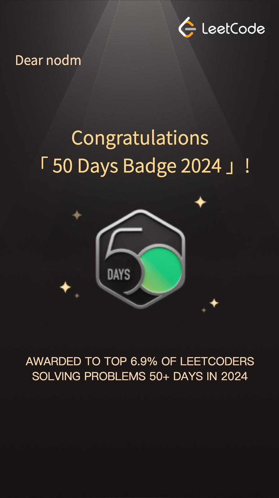
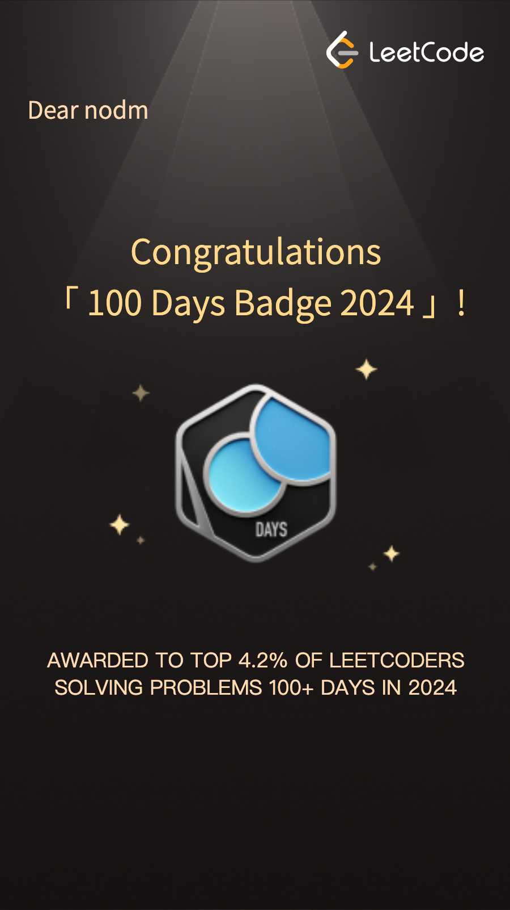

# my-leet-code

**Solving LeetCode problems**

## Array / String

| Name                                                                                                                      | Level  |
| :------------------------------------------------------------------------------------------------------------------------ | :----: |
| [Merge Sorted Array](./src/array-string/merge-sorted-array/README.md)                                                     |  Easy  |
| [Remove Element](./src/array-string/remove-element/README.md)                                                             |  Easy  |
| [Remove Duplicates from Sorted Array](./src/array-string/remove-duplicates-from-sorted-array/README.md)                   |  Easy  |
| [Remove Duplicates from Sorted Array II](./src/array-string/remove-duplicates-from-sorted-array-II/README.md)             | Medium |
| [Majority Element](./src/array-string/majority-element/README.md)                                                         |  Easy  |
| [Rotate Array](./src/array-string/rotate-array/README.md)                                                                 | Medium |
| [Best Time to Buy and Sell Stock](./src/array-string/best-time-to-buy-and-sell-stock/README.md)                           |  Easy  |
| [Best Time to Buy and Sell Stock II](./src/array-string/best-time-to-buy-and-sell-stock-II/README.md)                     | Medium |
| [Jump Game](./src/array-string/jump-game/README.md)                                                                       | Medium |
| [Jump Game II](./src/array-string/jump-game-II/README.md)                                                                 | Medium |
| [H-index](./src/array-string/h-index//README.md)                                                                          | Medium |
| [Insert Delete GetRandom O(1)](./src/array-string/insert-delete-get-random-o1/README.md)                                  | Medium |
| [Product of Array Except Self](./src/array-string/product-of-array-except-self/README.md)                                 | Medium |
| [Gas Station](./src/array-string/gas-station/README.md)                                                                   | Medium |
| [Roman to Integer](./src/array-string/roman-to-integer/README.md)                                                         |  Easy  |
| [Integer to Roman](./src/array-string/integer-to-roman/README.md)                                                         | Medium |
| [Length of Last Word](./src/array-string/length-of-last-word/README.md)                                                   |  Easy  |
| [Longest Common Prefix](./src/array-string/longest-common-prefix/README.md)                                               |  Easy  |
| [Reverse Words in a String](./src/array-string/reverse-words-in-a-string/README.md)                                       | Medium |
| [Zigzag Conversion](./src/array-string/zigzag-conversion/README.md)                                                       | Medium |
| [Find the Index of the First Occurrence in a String (implement strStr())](./src/array-string/implement-str-str/README.md) |  Easy  |

## Two Pointers

| Name                                                                                       | Level  |
| :----------------------------------------------------------------------------------------- | :----: |
| [Valid Palindrome](./src/two-pointers/valid-palindrome/README.md)                          |  Easy  |
| [Is Subsequence](./src/two-pointers/is-subsequence/README.mds)                             |  Easy  |
| [Two Sum II - Input Array Is Sorted](./src/two-pointers/two-sum-II-input-array-is-sorted/) | Medium |
| [Container With Most Water](./src/two-pointers/container-with-most-water/README.md)        | Medium |
| [3Sum](./src/two-pointers/3-sum/README.md)                                                 | Medium |

## Sliding Window

| Name                                                                                                                            | Level  |
| :------------------------------------------------------------------------------------------------------------------------------ | :----: |
| [Minimum Size Subarray Sum](./src/sliding-window/minimum-size-subarray-sum/README.md)                                           | Medium |
| [Longest Substring Without Repeating Characters](./src/sliding-window/longest-substring-without-repeating-characters/README.md) | Medium |

## Matrix

| Name                                                          | Level  |
| :------------------------------------------------------------ | :----: |
| [Valid Sudoku](./src/matrix/valid-sudoku/README.md)           | Medium |
| [Spiral Matrix](./src/matrix/spiral-matrix/README.md)         | Medium |
| [Rotate Image](./src/matrix/rotate-image/README.md)           | Medium |
| [Set Matrix Zeroes](./src/matrix/set-matrix-zeroes/README.md) | Medium |
| [Game of Life](./src/matrix//game-of-life/README.md)          | Medium |

## Hashmap

| Name                                                                                 | Level  |
| :----------------------------------------------------------------------------------- | :----: |
| [Ransom Note](./src/hashmap/ransom-note/README.md)                                   |  Easy  |
| [Isomorphic Strings](./src/hashmap/isomorphic-strings/README.md)                     |  Easy  |
| [Word Pattern](./src/hashmap/word-pattern/README.md)                                 |  Easy  |
| [Valid Anagram](./src/hashmap/valid-anagram/README.md)                               |  Easy  |
| [Group Anagrams](./src/hashmap/group-anagrams/README.md)                             | Medium |
| [Two Sum](./src/hashmap/two-sum/README.md)                                           |  Easy  |
| [Happy Number](./src/hashmap/happy-number/README.md)                                 |  Easy  |
| [Longest Consecutive Sequence](./src/hashmap/longest-consecutive-sequence/README.md) | Medium |

## Intervals

| Name                                                                                                               | Level  |
| :----------------------------------------------------------------------------------------------------------------- | :----: |
| [Summary Ranges](./src/intervals/summary-ranges/README.md)                                                         |  Easy  |
| [Merge Intervals](./src/intervals/merge-intervals/README.md)                                                       | Medium |
| [Insert Interval](./src/intervals/insert-interval/README.md)                                                       | Medium |
| [Minimum Number of Arrows to Burst Balloons](./src/intervals/minimum-number-of-arrows-to-burst-balloons/README.md) | Medium |

## Stack

| Name                                                                                       | Level  |
| :----------------------------------------------------------------------------------------- | :----: |
| [Valid Parentheses](./src/stack/valid-parentheses/README.md)                               |  Easy  |
| [Simplify Path](./src/stack//simplify-path/README.md)                                      | Medium |
| [Min Stack](./src/stack/min-stack/README.md)                                               |  Easy  |
| [Evaluate Reverse Polish Notation](./src/stack/evaluate-reverse-polish-notation/README.md) | Medium |

## Linked List

| Name                                                                                                       | Level  |
| :--------------------------------------------------------------------------------------------------------- | :----: |
| [Linked List Cycle](./src/linked-list/linked-list-cycle/README.md)                                         |  Easy  |
| [Add Two Numbers](./src/linked-list/add-two-numbers/README.md)                                             | Medium |
| [Merge Two Sorted Lists](./src/linked-list/merge-two-sorted-lists/README.md)                               |  Easy  |
| [Copy List with Random Pointer](./src/linked-list/copy-list-with-random-pointer/README.md)                 | Medium |
| [Reverse Linked List II](./src/linked-list/reverse-linked-list-II/README.md)                               | Medium |
| [Remove Nth Node From End of List](./src/linked-list/remove-nth-node-from-end-of-list/README.md)           | Medium |
| [Remove Duplicates from Sorted List II](./src/linked-list/remove-duplicates-from-sorted-list-II/README.md) | Medium |
| [Rotate List](./src/linked-list/rotate-list/README.md)                                                     | Medium |
| [Partition List](./src/linked-list/partition-list/README.md)                                               | Medium |
| [LRU Cache](./src/linked-list/lru-cache/README.md)                                                         | Medium |

## Binary Tree General

| Name                                                                                                                                                 | Level  |
| :--------------------------------------------------------------------------------------------------------------------------------------------------- | :----: |
| [Maximum Depth of Binary Tree](./src/binary-tree-general/maximum-depth-of-binary-tree/README.md)                                                     |  Easy  |
| [Same Tree](./src/binary-tree-general/same-tree/README.md)                                                                                           |  Easy  |
| [Invert Binary Tree](./src/binary-tree-general/invert-binary-tree/README.md)                                                                         |  Easy  |
| [Symmetric Tree](./src/binary-tree-general/symmetric-tree/README.md)                                                                                 |  Easy  |
| [Construct Binary Tree from Preorder and Inorder Traversal](./src/binary-tree-general/construct-tree-from-preorder-and-inorder-traversal/README.md)  | Medium |
| [Construct Binary Tree from Inorder and Postorder Traversal](./src/binary-tree-general/construct-tree-from-inorder-and-postorder-traversal/index.ts) | Medium |
| [Populating Next Right Pointers in Each Node II](./src/binary-tree-general/populating-next-right-pointers-in-each-node-II/README.md)                 | Medium |
| [Path Sum](./src/binary-tree-general/path-sum/README.md)                                                                                             |  Easy  |
| [Sum Root to Leaf Numbers](./src/binary-tree-general/sum-root-to-leaf-numbers/README.md)                                                             | Medium |
| [Flatten Binary Tree to Linked List](./src/binary-tree-general/flatten-binary-tree-to-linked-list/README.md)                                         | Medium |
| [Binary Search Tree Iterator](./src/binary-tree-general/binary-search-tree-iterator/README.md)                                                       | Medium |
| [Count Complete Tree Nodes](./src/binary-tree-general/count-complete-tree-nodes/README.md)                                                           |  Easy  |
| [Lowest Common Ancestor of a Binary Tree](./src/binary-tree-general/lowest-common-ancestor-of-a-binary-tree/README.md)                               | Medium |

## Binary Tree BFS

| Name                                                                                                                 | Level  |
| :------------------------------------------------------------------------------------------------------------------- | :----: |
| [Binary Tree Right Side View](./src/binary-tree-bfs/binary-tree-right-side-view/README.md)                           | Medium |
| [Average of Levels in Binary Tree](./src/binary-tree-bfs/average-of-levels-in-binary-tree/README.md)                 |  Easy  |
| [Binary Tree Level Order Traversal](./src/binary-tree-bfs/binary-tree-level-order-traversal/README.md)               | Medium |
| [Binary Tree Zigzag Level Order Traversal](./src/binary-tree-bfs/binary-tree-zigzag-level-order-traversal/README.md) | Medium |

## Binary Search Tree

| Name                                                                                                        | Level  |
| :---------------------------------------------------------------------------------------------------------- | :----: |
| [Minimum Absolute Difference in BST](./src/binary-search-tree/minimum-absolute-difference-in-bst/README.md) |  Easy  |
| [Kth Smallest Element in a BST](./src/binary-search-tree/k-th-smallest-element-in-a-bst/README.md)          | Medium |
| [Validate Binary Search Tree](./src/binary-search-tree/validate-binary-search-tree/README.md)               | Medium |

## Graph General

| Name                                                                                         | Level  |
| :------------------------------------------------------------------------------------------- | :----: |
| [Number of Islands](./src/graph-general/number-of-islands/README.md)                         | Medium |
| [Binary Tree Zigzag Level Order Traversal](./src/graph-general/surrounded-regions/README.md) | Medium |
| [Clone Graph](./src/graph-general/clone-graph/README.md)                                     | Medium |
| [Evaluate Division](./src/graph-general/evaluate-division/README.md)                         | Medium |
| [Course Schedule](./src/graph-general/course-schedule/README.md)                             | Medium |
| [Course Schedule II](./src/graph-general/course-schedule-ii/README.md)                       | Medium |

## Graph BFS

| Name                                                                           | Level  |
| :----------------------------------------------------------------------------- | :----: |
| [Snakes and Ladders](./src/graph-bfs/snakes-and-ladders/README.md)             | Medium |
| [Minimum Genetic Mutation](./src/graph-bfs/minimum-genetic-mutation/README.md) | Medium |

## Trie

| Name                                                                                                          | Level  |
| :------------------------------------------------------------------------------------------------------------ | :----: |
| [Implement Trie (Prefix Tree)](./src/trie/implement-trie_prefix-tree/README.md)                               | Medium |
| [Design Add and Search Words Data Structure](./src/trie/design-add-and-search-words-data-structure/README.md) | Medium |
| [Word Search II](./src/trie/word-search-II/README.md)                                                         |  Hard  |

## Backtracking

| Name                                                                                                        | Level  |
| :---------------------------------------------------------------------------------------------------------- | :----: |
| [Letter Combinations of a Phone Number](./src/backtracking/letter-combinations-of-a-phone-number/README.md) | Medium |
| [Combinations](./src/backtracking/combinations/README.md)                                                   | Medium |

## Divide & Conquer

| Name                                                                                                                        | Level |
| :-------------------------------------------------------------------------------------------------------------------------- | :---: |
| [Convert Sorted Array to Binary Search Tree](./src/divide-and-conquer/convert-sorted-array-to-binary-search-tree/README.md) | Easy  |

## Kadane's Algorithm

| Name                                                                   | Level  |
| :--------------------------------------------------------------------- | :----: |
| [Maximum Subarray](./src/kadanes-algorithm/maximum-subarray/README.md) | Medium |

## Binary Search

| Name                                                                                                                                             | Level  |
| :----------------------------------------------------------------------------------------------------------------------------------------------- | :----: |
| [Search Insert Position](./src/binary-search//search-insert-position/README.md)                                                                  |  Easy  |
| [Search a 2D Matrix](./src/binary-search/search-a-2d-matrix/README.md)                                                                           | Medium |
| [Find Peak Element](./src/binary-search/find-peak-element/README.md)                                                                             | Medium |
| [Search in Rotated Sorted Array](./src/binary-search/search-in-rotated-sorted-array/README.md)                                                   | Medium |
| [Find First and Last Position of Element in Sorted Array](./src/binary-search/find-first-and-last-position-of-element-in-sorted-array/README.md) | Medium |
| [Find Minimum in Rotated Sorted Array](./src/binary-search/find-minimum-in-rotated-sorted-array/README.md)                                       | Medium |

## Heap

| Name | Level |
| :--- | :---: |

## Bit Manipulation

| Name                                                                                          | Level |
| :-------------------------------------------------------------------------------------------- | :---: |
| [Add Binary](./src/bit-manipulation/add-binary/README.md)                                     | Easy  |
| [Number of 1 Bits](./src/bit-manipulation/number-of-1-bits/README.md)                         | Easy  |
| [Reverse Bits](./src/bit-manipulation/reverse-bits/README.md)                                 | Easy  |
| [Single Number](./src/bit-manipulation/single-number/README.md)                               | Easy  |
| [Single Number II](./src/bit-manipulation/single-number-II/README.md)                         | Easy  |
| [Bitwise AND of Numbers Range](./src/bit-manipulation/bitwise-and-of-numbers-range/README.md) | Easy  |

## Math

| Name                                                        | Level |
| :---------------------------------------------------------- | :---: |
| [Palindrome Number](./src/math/palindrome-number/README.md) | Easy  |
| [Plus One](./src/math/plus-one/README.md)                   | Easy  |
| [Sqrt(x)](./src/math/sqrt-x/README.md)                      | Easy  |

## 1D Dynamic Programming

| Name                                                                      | Level  |
| :------------------------------------------------------------------------ | :----: |
| [Climbing Stairs](./src/dynamic-programming-1d/climbing-stairs/README.md) |  Easy  |
| [House Robber](./src/dynamic-programming-1d/house-robber/README.md)       | Medium |

## Multidimensional Dynamic Programming

| Name | Level |
| :--- | :---: |

## Array

- [Intersection of Two Arrays II](./src/array/1-easy/intersection-of-two-arrays-2/README.md)
- [Contains Duplicate](./src/array/1-easy/contains-duplicate/README.md)
- [Move Zeroes](./src/array/1-easy/move-zeroes/README.md)

## Strings

- [Reverse String](./src/strings/1-easy/reverse-string/README.md)
- [First Unique Character in a String](./src/strings/1-easy/first-unique-character-in-a-string/README.md)
- [String to Integer (atoi)](./src/strings/1-easy/string-to-Integer-atoi/README.md)
- [Reverse Integer](./src/strings/1-easy/reverse-integer/README.md)

## Linked List

- [Reverse Linked List](./src/linked-list/1-easy/reverse-linked-list/README.md)
- [Palindrome Linked List](./src/linked-list/1-easy/palindrome-linked-list/README.md)
- [Delete Node in a Linked List](./src/linked-list/1-easy/delete-node-in-linked-list/README.md)

## Sorting and Searching

- [First Bad Version](./src/sorting-and-searching/1-easy/first-bad-version/README.md)

## Design

- [Shuffle an Array](./src/design/1-easy/shuffle-an-array/README.md)

## Math

- [Fizz Buzz](./src/math/1-easy/fizz-buzz/README.md)
- [Count Primes](./src/math/1-easy/count-primes/README.md)
- [Power of Three](./src/math/1-easy/power-of-three/README.md)

## Others

- [Hamming Distance](./src/others/1-easy/hamming-distance/README.md)
- [Pascal's Triangle](./src/others/1-easy/pascals_triangle/README.md)
- [Missing Number](./src/others/1-easy/missing-number/README.md)

