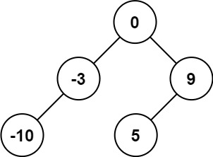

# Convert Sorted Array to Binary Search Tree

Given an integer array `nums` where the elements are sorted in **ascending order**, convert __it to a **height-balanced** binary search tree__.

**Example 1:**


```
Input: nums = [-10,-3,0,5,9]
Output: [0,-3,9,-10,null,5]
Explanation: [0,-10,5,null,-3,null,9] is also accepted:
```


**Example 2**


```
Input: nums = [1,3]
Output: [3,1]
Explanation: [1,null,3] and [3,1] are both height-balanced BSTs.
```

**Constraints:**
* `1 <= nums.length <= 104`
* `-104 <= nums[i] <= 104`
* `nums` is sorted in a **strictly increasing** order.
